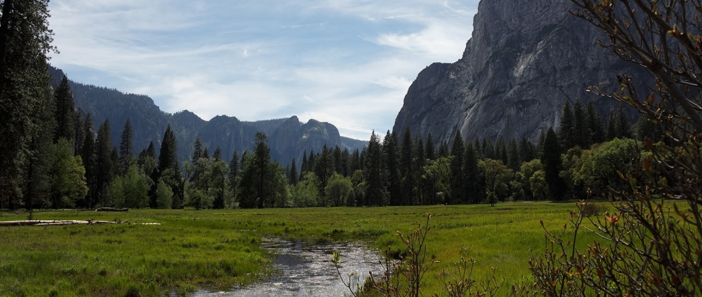

# Hi 👋 I’m @GregDoesStuff

  

I’m making the transition from Business Ownership to  Cybersecurity.

To learn more about me, visit my <a href="https://www.linkedin.com/in/gregdoesstuff/">Linkedin Profile</a>.

- 🌱 I’m currently learning the basics, studying for my Security+ first, and building on my knowledge base of IT/Networking experience.
- 💞️ I’m looking to collaborate on Cybersecurity topics!
- 📫 How to reach me? On Twitter @GregWilsonTahoe

  

  

  

  

<!---
GregDoesStuff/GregDoesStuff is a ✨ special ✨ repository because its `README.md` (this file) appears on your GitHub profile.
You can click the Preview link to take a look at your changes.
--->
